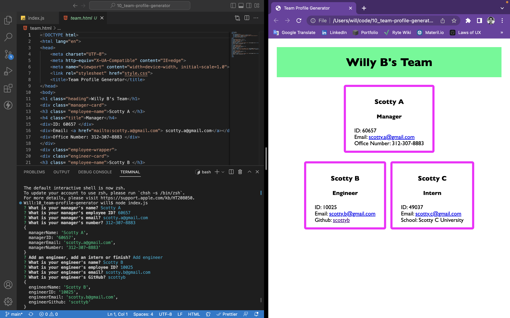

# Team Profile Generator

I completed this challenge during office hours with my cohort.

Similar to the README Generator, this team profile generator provided an HTML file using Node.js.

This was my first challenge creating tests and a library of class-derived objects that were pushed using module exports.

Although my classmates and I completed this class together, I went ahead and tinkered with copy to get a better understanding of how the generateHTML and createTeam functions work within the index.js file.

As specified in the Challenge Acceptance Criteria, the generator achieves the following:

✨ An HTML file that displays a nicely formatted team roster based on user input.

✨ The GitHub profile opens in a new tab.

✨ The application prompts to enter the team manager’s name, employee ID, email address, and office number.

✨ The application presents with a menu with the option to add an engineer or an intern or to finish building my team.

✨ The "Add an engineer" option prompts to enter the engineer’s name, ID, email, and GitHub username, and I am taken back to the menu.

✨ The "Add an intern" option prompts to enter the intern’s name, ID, email, and school, and I am taken back to the menu.

✨ The "Finish" option exit the application, and the HTML is generated.

Below is a screenshot of my latest and greatest:

To check out the full experience, watch the video recording of the generated team profile [here](https://drive.google.com/file/d/1dJ4BJTdjtXeWVQ5IOgV2sVEyGIKo4zpq/view?usp=sharing).
